# SRAG RIDE-DF

Série histórica (**2019 em diante**) da base de **SRAG (OpenDATASUS)** contendo
apenas os municípios da **RIDE-DF**. O bruto nacional (parquet, ~350 MB somando
os anos) é baixado, filtrado e só os recortes enxutos são versionados no GitHub,
em **parquet** (a série inteira ocupa ~11 MB).

## Arquitetura

```mermaid
flowchart LR
    S[Página do dataset<br/>data da última atualização] -->|01_download.R<br/>compara com o manifesto| A
    A[OpenDATASUS<br/>INFLUDaa-DD-MM-AAAA.parquet<br/>1 por ano] -->|só os anos que mudaram| B[data-raw/<br/>bruto, gitignored]
    B -->|02_filter_clean.R<br/>DuckDB| C[data/historico/bruto/<br/>recorte RIDE por ano .parquet]
    C -->|03_prepara.R<br/>só os anos alterados| P[data/historico/pronto/<br/>base analítica por ano .parquet<br/>+ serie_semanal.csv]
    P -->|git commit/push| D[(GitHub)]
    E[GitHub Actions<br/>seg e ter] -.orquestra.-> S
```



Princípios:
- **Bruto nunca vai pro Git.** Fica em `data-raw/` (no `.gitignore`).
- **Um arquivo por ano, em parquet (ZSTD).** Os anos antigos ficam congelados
  no OpenDATASUS por meses; separando por ano, o commit semanal só toca
  2025/2026 (~2 MB) e o repositório não incha. O maior arquivo tem ~2 MB.
- **Parquet em vez de CSV.** A base pronta da série caiu de ~64 MB para ~3 MB
  e é lida em ~0,4 s (eram ~3 s), já com datas, lógicos e números tipados.
- **Atualização incremental.** O `01` lê na página do dataset a revisão
  publicada de cada ano e compara com `data/historico/manifesto.csv`. Só baixa
  o ano cujo arquivo mudou (nome ou data de modificação); o `03` só refaz a
  base pronta dos anos cujo recorte mudou (ou de todos, se o script mudar).
- **DuckDB de ponta a ponta**: o filtro lê só as linhas da RIDE-DF e o preparo
  lê só as ~55 colunas que usa, sem carregar tudo na RAM.
- **Automação** via GitHub Actions; commita só se algum dado mudou.

## Estrutura

```
srag_ride_dados/
├── R/
│   ├── config.R            # códigos RIDE-DF, descoberta das URLs, caminhos
│   ├── 01_download.R       # confere a última atualização e baixa o que mudou
│   ├── 02_filter_clean.R   # filtra com DuckDB -> recorte por ano
│   ├── 03_prepara.R        # derivações -> base pronta por ano + série semanal
│   └── ler_historico.R     # ler_srag_ride(): carrega a série pronta
├── run_pipeline.R          # orquestra 01 + 02
├── data/
│   ├── dados_limpos_df.csv         # recorte do ANO CORRENTE (como sempre foi)
│   ├── srag_ride_pronto.csv        # base pronta do ANO CORRENTE (lida pelo app)
│   └── historico/
│       ├── manifesto.csv           # revisão de cada ano que está no repositório
│       ├── serie_semanal.csv       # casos, óbitos e UTI por SE (toda a série)
│       ├── bruto/srag_ride_bruto_AAAA.parquet   # 194 colunas originais
│       └── pronto/srag_ride_pronto_AAAA.parquet # 48 colunas analíticas
├── .github/workflows/atualizar-dados.yml
└── .gitignore
```

## Como rodar localmente

```bash
Rscript -e 'install.packages(c("duckdb","DBI","curl","jsonlite","dplyr","tidyr","stringr","lubridate","readr"))'
Rscript run_pipeline.R        # baixa e filtra só o que mudou
Rscript R/03_prepara.R        # gera as bases prontas e a série semanal
```

Opções (variáveis de ambiente):

| Variável | Para quê | Padrão |
|---|---|---|
| `SRAG_ANO_INICIAL` | primeiro ano da série | `2019` |
| `SRAG_ANOS` | conferir só alguns anos, ex.: `2025,2026` | série toda |
| `SRAG_FORCAR` | `1` para rebaixar e refazer tudo | desligado |
| `SRAG_URLS` | fixar as URLs à mão (separadas por vírgula) | descoberta automática |
| `SRAG_JANELA_DIAS` | dias para trás na sondagem do S3, se o site falhar | `35` |

No GitHub, o botão **Run workflow** aceita os mesmos `anos` e `forcar`.

## Como usar a série

```r
source("R/ler_historico.R")
srag <- ler_srag_ride()                  # 2019 em diante
srag <- ler_srag_ride(anos = 2023:2026)  # só alguns anos
srag <- ler_srag_ride(colunas = c("periodo_se", "classificacao_final"))  # só o necessário
```

Outras formas de abrir os mesmos arquivos:

```r
arrow::open_dataset("data/historico/pronto")            # R, com dplyr
```
```python
import pandas as pd
df = pd.read_parquet("data/historico/pronto")           # Python
```
```sql
-- DuckDB; no recorte bruto use union_by_name (o tipo de 4 colunas varia por ano)
SELECT * FROM read_parquet('data/historico/bruto/*.parquet', union_by_name = true);
```

Os dois CSV na raiz de `data/` existem só para o app atual, que lê CSV. Quando
ele passar a ler o parquet, dá para aposentá-los.

Para curvas históricas, `data/historico/serie_semanal.csv` já traz a contagem
por semana epidemiológica, território de residência e classificação final.

## Atualização da fonte

O nome do arquivo no OpenDATASUS carrega a **data da revisão**
(`INFLUD26-DD-MM-AAAA.parquet`), então muda a cada atualização. O pipeline
descobre a revisão vigente de cada ano nesta ordem:

1. `SRAG_URLS`, se informada;
2. a [página do dataset](https://dadosabertos.saude.gov.br/dataset/srag-2019-a-2026),
   que traz o nome, a URL e a data de modificação de cada recurso;
3. sondagem no S3 pelas datas dos últimos 35 dias (se o site estiver fora);
4. a revisão já registrada no manifesto (nada novo publicado).

## Notas metodológicas

- **Critério de inclusão:** município de notificação **ou** de residência na
  RIDE-DF (34 municípios, LC 163/2018).
- **Semana epidemiológica:** calculada pela data dos primeiros sintomas,
  conforme o calendário oficial (domingo a sábado). O campo `SEM_PRI` do Sivep
  não é usado porque diverge do calendário na virada 2025/2026: marca
  28/12/2025–03/01/2026 como SE 01 (o oficial é SE 53/2025) e deixa 2026 uma
  semana adiantado.
- **`id_caso`** nos arquivos por ano é `ano × 1.000.000 + sequência`; é único
  na série, mas não é estável entre revisões (não use como chave permanente).
- **População:** `populacao_residencia` e `populacao_ra` são um valor fixo por
  território, repetido em todos os anos. Para incidência histórica, use
  denominadores do ano correspondente.
